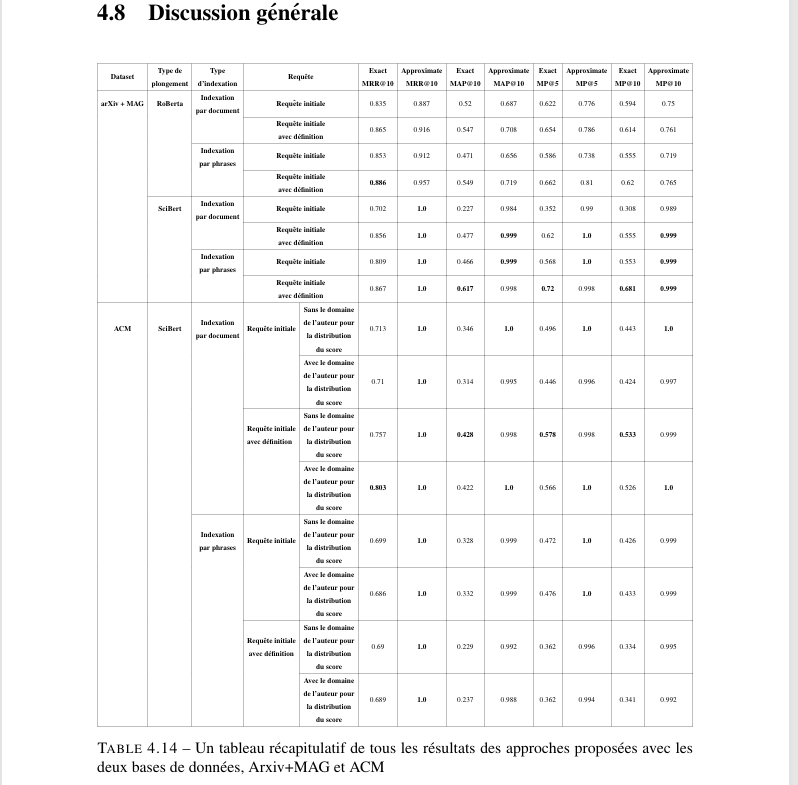
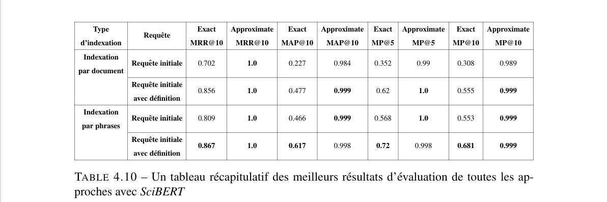
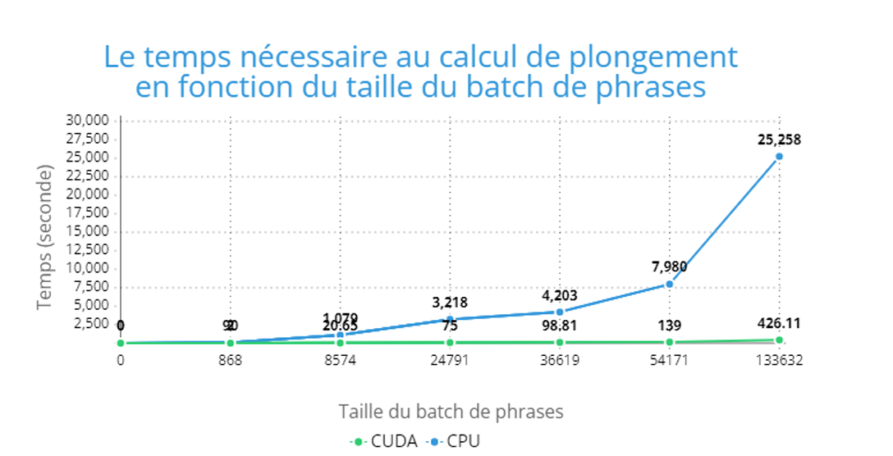

# Academic Expert Search - Graduation Project

This repository contains the source code, datasets, and documentation for our **Master's graduation project**, which focuses on **scientific expert search using deep learning**. Our project was presented at **TAMARICS 2022**, an international conference held at the University of Tamanghasset, Algeria [Check out my LinkedIn!](https://www.linkedin.com/posts/chakib-houati_tamarics-conference-artificialintelligence-activity-7015081826863960064-GckN?utm_source=share&utm_medium=member_desktop&rcm=ACoAADsWixIBaod4ObSEe6Iex8HIWodDMVIUGaM).

## 📌 Project Overview
Scientific expert search is a crucial task in the academic world, used for identifying researchers for supervision, evaluation, or collaboration. Our work aims to enhance expert search systems by leveraging **deep learning** and **natural language processing (NLP)** techniques, specifically transformer-based models like **BERT, SciBERT, and RoBERTa**. 

### 🔍 Key Contributions
- **New indexing approach**: Sentence-based indexing instead of full-document indexing.
- **Query expansion**: Augmenting search queries using definitions to improve accuracy.
- **Score distribution adjustment**: Mitigating the dominance of highly prolific authors.
- **Dataset creation**: A new test corpus extracted from ACM for better benchmarking for the Algerian Expert Search task.
- **Optimization**: Implemented FAISS indexing with CUDA acceleration for efficient similarity search..

## 📂 Repository Structure
```
/Project-Name
│── /Evaluation            # Scripts for evaluating our methods and comparing them with previous works
│── /Results               # Comprehensive collection of results described in the article (binary files and CSVs), including plots
│── /Scraping              # Web scraping scripts used for dataset construction
│── /Test_&_Tutos          # Testing scripts and tutorial notebooks
│── /Web_Site              # Codebase for the web portal implementation
│── /Weighted_Sampling     # Utility package used within the code
│── /Masters-Graduation-Project  # Script for building the FAISS Index for efficient similarity search ([FAISS - AI Meta](https://ai.meta.com/tools/faiss/))
│── /main_&_execution      # Backend scripts handling app connection, indexing, query augmentation, and similarity search
│── /docs                  # Documentation and articles
│   │── full-article.pdf   # Detailed article about the project (French)
│   │── TAMARICS_2022.pdf  # Summary article presented at TAMARICS 2022 (English)
│   │── slides.pdf         # Presentation slides (English)
│── README.md              # Overview of the project

```

## 📖 Documentation
- **[TAMARICS 2022 Article](./Docs/TAMARICS_2022.pdf)**: A summary of our project presented at an international competition.
- **[Full Project Report](./Docs/full-article.pdf)**: A comprehensive document detailing our methods and findings.
- **[Presentation Slides](./Docs/slides.pdf)**: Key insights from our work in a slide format.

## 📊 Key Charts & Results
Here are some key visual results from our project:

  
*Figure 1: Performance comparison of different indexing methods.*

  
*Figure 2: Effect of query expansion on retrieval accuracy.*

  
*Figure 3: Analysis of gain in time while using CUDA (Nvidia Gtx 1660 Ti) compared to CPU (Ryzen 7 4800H).*

## ⚙️ Installation & Usage
1. Clone the repository:
   ```sh
   git clone https://github.com/chakibMH/Masters-Graduation-Project.git
   cd Masters-Graduation-Project
   ```

   ```
2. Run the main AI part:
   ```sh
   python main_ranking.py
   ```

## 🏆 Acknowledgments
This project was developed as part of our **Master’s thesis** at **University of Science and Technology Houari Boumediene** and was supervised by [ BELLAZZOUGUI Djamal and Mr. CHAA Messaoud ]. Special thanks to **TAMARICS 2022** for providing a platform to present our research.

---
📌 *For more details, check the articles in the `/docs` folder.*
